# Projet C++

This project is an academic project on the use of C++ in the field of Finance, specifically focusing on the pricing of Call and Put options. 

This project aims to implement option pricing models, including Black-Scholes and Cox-Ross-Rubinstein, in C++ to price European and American options and determine early exercise policies. It involves validating pricing methods using closed-form solutions, Monte Carlo simulations, and a binary tree structure for modeling asset price evolution.

$$\hat{Z}_{t_1}, \dots, \hat{Z}\substack{t_m}$$
## Part I
# Black-Scholes Model
### 1 - Model specification
A European vanilla option has the following characteristics:
- Type: Call or Put (to be modelled with an enum)
- Strike price: $K$
- Expiry date: $T$  
  
Its price depends on the following market data:
- Underlying price: $S$
- Interest rate: $r$  
  
The following parameter is also required in order to price the option:
- Volatility: $\sigma$  
  
### 2 - Implementation  

1. Implement the abstract class Option:
   
- with a private member double _expiry, along with a getter method getExpiry()
- with a pure virtual method double payoff(double), payoff() represents the payoff function
of the option, denoted by h in this document
- write a constructor that initialize _expiry with an argument  
  
2. Derive Option into another abstract class EuropeanVanillaOption:  
     
- with private attributes double _strike
- write a constructor which initialize _expiry and _strike with arguments (call the base
constructor)
- the constructor should ensure that the arguments are nonnegative
- write a classe enum optionType that has two values: call and put
- write an pure virtual method GetOptionType() which should return an optionType enum
  
3. Derive EuropeanVanillaOption into two classes: CallOption and PutOption.  

- They should use the constructor of EuropeanVanillaOption
- For a Call option with strike $K$, the payoff is given by:  
  
$$
h(z) =
\begin{cases} 
      z - K & \text{if } z \geq K \\
      0 & \text{otherwise} 
\end{cases}
$$
  
- For a Put option with strike $K$, the payoff is given by:  
  
$$
h(z) =
\begin{cases} 
      K - Z & \text{if } z \leq K \\
      0 & \text{otherwise} 
\end{cases}
$$
  
- Override the GetOptionType() accordingly in the derived classes  
  
4. Create the class BlackScholesPricer  
  
- With constructor BlackScholesPricer(EuropeanVanillaOption* option, double asset_price,
double interest_rate, double volatility)
- Declare BlackScholesPricer as a friend class of EuropeanVanillaOption in order for the
former to access the strike of the latter
- Write the operator() which returns the price of the option. The Black-Scholes formula
can be found on the internet. (Hint: use std::erfc.)
- Write the method delta() which returns the Delta of the option  
  
## Part II
# The Cox-Ross-Rubinstein model
### 3 - The CRR model

In the CRR model the price of an asset evolves in discrete time steps $(n = 0, 1, 2, \dots )$. Randomly,
it can move up by a factor 1+U or down by 1+D independently at each time step, starting from
the spot price $S_0$ (see Figure below).
  

  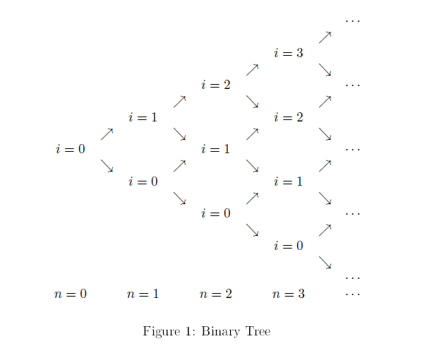

  
  
As a result, the stock price at step n and node i is:
  
$$ 
S(n, i) = S_0 (1+U)^i (1+D)^{n-i}
$$

where $S_0 \geq 0$, $U > D > −1$ and $0 \leq i \leq n$. 

There is also a risk-free asset which grows by the factor $1 + R > 0$ at each time step 
(starting at 1 at step 0).
The model admits no arbitrage if and onfly if $D < R < U$.

In the CRR model the price $H(n, i)$ at time step n and node i of a European option 
with expiry date N and payoff $h(S (N))$ can be computed using the CRR procedure,
which proceeds by backward induction :

- At the expiry date $N$:  
  
$$
H(N, i) = h(S(N, i))
$$
  
for each node $i = 0, \dots , N$.

- If $H(n + 1, i)$ is already known for all nodes $i = 0, \dots , n + 1$ for some $n = 0, \dots , N − 1$,
then :

$$
H(n, i) = \frac{q H(n + 1, i + 1) + (1 - q) H(n + 1, i)}{1 + R}
$$

for each $i = 0, \dots , n$; and where $q$ is defined by

$$
q = \frac {R - D}{U - D}
$$
  
is called the risk-neutral probability.

### 4 - Implementation  

1. Implement a class BinaryTree that represents the data structure (path tree) used for the
CRR method:  
  
- It should be a template class BinaryTree<T>  
- It should have a member _depth, representing N
- It should contain a private member _tree, a vector of vectors (STL) to hold data of
type T
- Implement the setter method setDepth(int) a setter for _depth, that resizes _tree and
allocate/deallocate properly the vectors in tree
- Implement the setter method setNode(int, int, T) which sets the value stored in _tree
at the given indices
- Implement the getter method getNode(int, int) which retrives the corresponding value
- Implement the method display() which prints the all the values stored  
  

  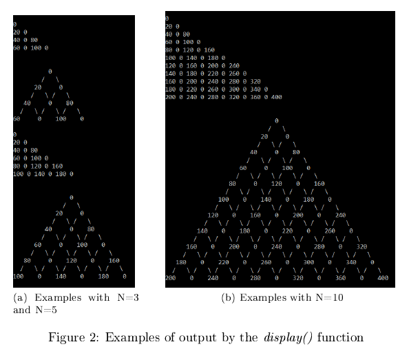

  
  
2. Create the class CRRPricer  
  
- With constructor CRRPricer(Option* option, int depth, double asset_price, double up,
double down, double interest_rate)
   - depth: $N$
   - asset_price: $S_0$
   - up, down, interest_rate: $U, D, R$ respectively
  
- In the constructor, check for arbitrage
- Create the tree structure to store the tree of the desired depth (hint: use BinaryTree
with an appropriate type)
- Write the method void compute() that implements the CRR procedure
- Write the getter method get(int, int) that returns $H(n, i)$.
- Write the operator() which returns the price of the option, it must call compute() if
needed
- The CRR method provides also a closed-form formula for option pricing:
  
$$
H(0, 0) = \frac{1}{(1 + R)^N} \sum_{i=0}^N \binom{N}{i} q^i (1 - q)^{N - i} h(S(N, i)).
$$
   
Put an optional argument bool closed_form that defaults to false to the operator().
When it is set to true, the above formula should be used instead of the CRR procedure.

4. Similarly to EuropeanVanillaOption, design EuropeanDigitalOption and its derived classes
(EuropeanDigitalCallOption and EuropeanDigitalPutOption) in order to take into account
the following type of options:
- Digital Call with payoff: $h(z) = 1_{z \geq K}$
- Digital Put with payoff: $h(z) = 1_{z \leq K}$

- Enable BlackScholesPricer to price digital options as well (closed form formulas also
exist for Black-Scholes prices and deltas for digital options)

## Part III 
# Path dependent options and MC (3h)
### 5 - Some option pricing theory  
  
5.1 European options and path-dependent option  
  
We consider a risky asset with the Black-Scholes dynamics:  

$$
S_t = S_0 e^{(r - \frac{\sigma^2}{2})t+\sigma W_t}
$$

where $\sigma \in \mathbb{R}^+$ is the volatility and $W_t$ a Wiener process under the risk neutral probability $\mathbb{Q}$.
We denote the price (at time 0) of an option by $H_0$.

This price can be determined by computing the expected discounted payoff under $\mathbb{Q}$:  

$$
H_0 = e^{-rT} \mathbb{E}^\mathbb{Q} [H_T]
$$  
 
where $H_T$ denotes the payoff of the option at its expiry date T.

5.1.1 European options  
  
In the case of a European option, $H_T = h(S_T)$, where $h : \mathbb{R}^+ \to \mathbb{R}$ is the payoff function of the
option, it only depends on the price of the risky asset at maturity.  
  
5.1.2 Path dependent options  
  
For more complex options, the payoff $H_T$ also depends on the price of the risky asset at dates
prior to the maturity.  
  
These are called path dependent options.
Let $t_k = \frac{k}{m} T$, for $k = 1, \dots ,m$.

A path-dependent option is a financial derivative with payoff at
expiry date T:

$$
H_T = h(S_{t_1}, \dots , S_{t_m})
$$

where $h : (\mathbb{R}^+)^m \to \mathbb{R}$ is the payoff function.  
For instance, the arithmetic Asian Call has the following payoff function:  
  
$$
h(z_1, \dots, z_m) = \left( \left( \frac{1}{m} \sum_{k=1}^m  z_k \right) - K \right)^+ 
$$ 
  
5.2 Black-Scholes random paths
The Wiener process W has independent increments, with $W_t − W_s ∼ \mathcal{N}(0, t − s)$ for $0 ≤ s < t$.

$S_{t_k}$ can be expressed as
  
$$
S_k = S_{k-1} e^{\left( r - \frac{\sigma^2}{2} \right) (t_k - t_{k-1}) + \sigma \sqrt{t_k - t_{k-1}} Z_k}
$$  
  
Where $Z_1, \dots , Z_m$ are i.i.d. random variables with distribution $\mathcal{N}(0, 1)$.
Let the seqence $\hat{Z_1}, \dots, \hat{Z_m}$ be a i.i.d. sample of $Z_1, \dots ,Z_m$. We refer the sequence
$\widehat{S_{t_1}}, \dots , \widehat{S_{t_m}}$

defined by:
  

  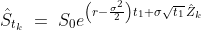

    
  

  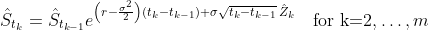

  
  
as a Black-Scholes sample path.
5.3 Monte Carlo
Let

bSi
t1 , · · · , bSi
tm

, for i ∈ N, be a sequence of independent sample paths. By the law of large
numbers
  

  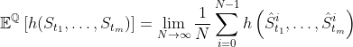

  
  
This means that for sufficient large N, we can approximate H0 using
  

  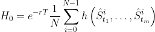

  
  
### 6 - Programming  
  
- Augment the Option class with payoffPath method, taking a std::vector<double> as argu-
ment, returning h(St1 , · · · , Stm).
- The non-overriden version of this function should return h (Stm) (calling payoff(double))
- Create a derived class from Option: AsianOption
- The constructor takes a std::vector<double> as argument, representing (t1, · · · , tm)
- The argument should be stored in a private member, with a getter method getTimeSteps()
- Override AsianOption::payoffPath(std::vector<double>) so that
  

  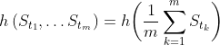

  
  
where h on the right hand side is payoff(double). AsianOption::payoffPath(std::vector<double>)
should not be virtual.
- Created AsianCallOption and AsianPutOption, derived from AsianOption.
- In addition to std::vector<double>, their constructor takes a double as argument, den-
ing the strike.
- They have to have proper implementations of payoff().
- Augment the Option class with bool isAsianOption(), returning false in its non-overriden
version, override it in AsianOption.
- In CRRPricer 's constructor, check if the option is an Asian option, if it is the case, throw
an exception.
- Design a singleton class MT, encapsulating a std::mt19937 object. Two public static methods
are implemented: double rand_unif() and double rand_norm(), returning a realization of
U ([0, 1]) and N (0, 1) respectively. Ensure that only one instance of std::mt19937 can be
used in all the program through MT.
- Write the BlackScholesMCPricer class:
   - The constructor must have signature (Option* option, double initial_price, double in-
terest_rate, double volatility)
   - The class should have a private attribute that counts the number of paths already
generated since the beginning of the program to estimate the price of the option,
a getter named getNbPaths() needs to give a read access to this attribute.
   - The method generate(int nb_paths) generates nb_paths new paths of (St1 , · · · , Stm)
(for European Option, m = 1), and UPDATES the current estimate of the price of
the option (the updating process is the same as in exercise 5 of the TD).
   - The operator () returns the current estimate (throw an exception if it is undefined).
   - The method condenceInterval() returns the 95% CI of the price, as a std::vector<double>
containing the lower bound and the upper bound.
   - The random generation have to be handled by calling MT::rand_norm().
   - No path should be stored in the object
   - Check the prices given by BlackScholesMCPricer are in line with those given by BlackScholesPricer on vanilla options.

## Part IV  
  
# Back to CRR (1-2h)  
  
### 7 - American option in the binomial model  
  
In addition to pricing European options, we want to include the ability to price American options
in the binomial model.  
The holder of an American option has the right to exercise it at any time up to and including the
expiry date N. If the option is exercised at time step n and node i of the binomial tree, then the
holder will receive payoff h (S (n, i)).  
The price H (n, i) of an American option at any time step n and node i in the binomial tree can
be computed by the following procedure, which proceeds by backward induction on n:
  
- At the expiry date N: H (N, i) has the same value as for the option's European counterpart.
Financial interpretation: if not exercised before the expiry, there is no advantage holding an
American option over holding a European option.

- If H (n + 1, i) is already known at each node i ∈ {0, · · · , n + 1} for some n < N, then
  

  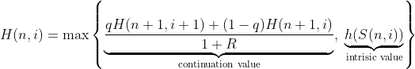

  
  
for each i ∈ {0, · · · , n}.  
  
Financial interpretation: the option holder chooses the maximum between the continuation
value (expected gain if they do not exercise, under the risk-neutral measure) and the intrinsic
value (the value of the option if exercised immediately).
In particular, H (0, 0) at the root node of the tree is the price of the American option at time 0.
We would like to compute and store the price of an American option for each time step n and node
i in the binomial tree. In addition, we want to compute the early exercise policy, which should be
of Boolean type and tells if the American option should be exercised or not for each state of the
tree. The early exercise policy should also be stored using an instance of BinaryTree<bool>.  
  
### 8 - Black-Scholes as limit of the binomial tree  
  
The binomial model can be used to approximate the Black-Scholes model if N is large.
One of the scheme is to divide the time interval [0, T] into N steps of length h = T/N, and set the
parameters of the binomial model to be:
  

  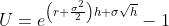

  
  

  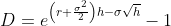

  
  

  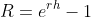

  
  
where σ is the volatility and r is the continuously compounded interest rate in the Black-Scholes
model.

Implement a method to initialize a Binomial tree as a Black-Scholes approximation (using the
Black-Scholes parameters). Compare option prices with the Monte Carlo method and the closed
form method for European options.  

### 9 - Implementation  
  
- Augment the Option class with bool isAmericanOption() which returns false in its non-
overriden version.  
- Derive Option into AmericanOption, and override isAmericanOption() properly.  
- Derive AmericanOption into AmericanCallOption and AmericanPutOption, write proper
constructors and override their respective payoff() methods.  
- Modify CRRPricer in order for it to price properly American options; the exercise condition
for American options is stored in a BinaryTree<bool>, accessible through a getter method
bool getExercise(int, int).
The exercise condition is true when the intrinsic value is larger or equal to the continuous
value, it is computed during the CRR procedure.  
- Overload the CRRPricer with CRRPricer(Option* option, int depth, double asset_price,
double r, double volatility), which initializes U, D and R as described in Section 6.

### 10 - Test your program!  
  
- Use the test files available on DVL containing the grading main() functions.  
